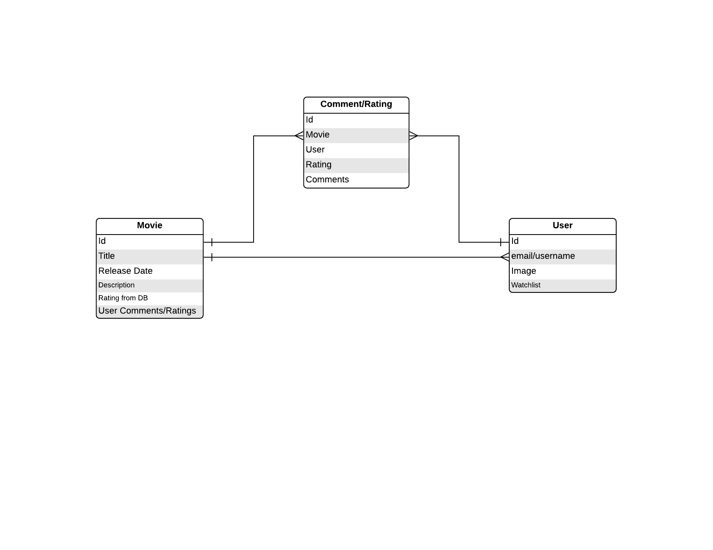
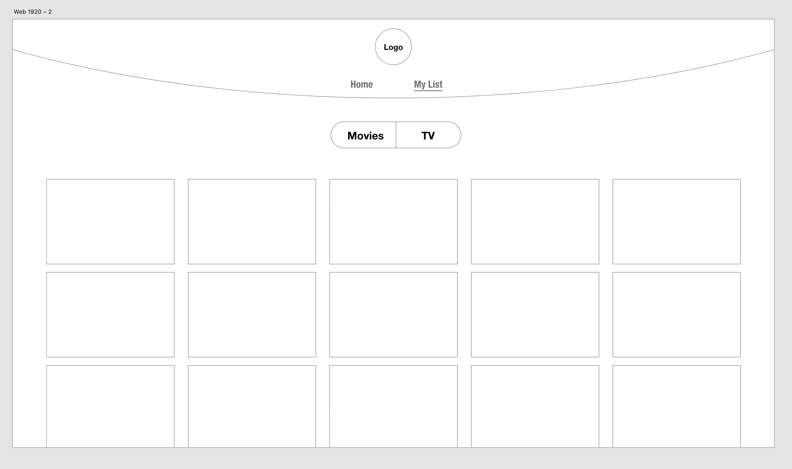

# Sleuthify

Contributers: Dan Engel && Jeremy Brazell && Peter Staker

Sleuthify is a simple solution for exploring new movies. Users can discover movies, store them to their watchlist and add comments and ratings.

## Conflict Plan

What is the group process to resolve conflict, when it arises?

Try to reach internal resolution by to finding middle ground and compromise. Have third member mediate. Step away from conflict to reflect before further discussion.

How will you raise concerns to members who are not adequately contributing?

Engage in civil discourse. Ask questions about what is going on with that member and try to be understanding.

How and when will you escalate the conflict if your resolution attempts are unsuccessful?

If we're unable to resolve the conflict after multiple attempts and civil discourse.

## Communication Plan

How will you communicate after hours and on the weekend?

Slack - keep notifications on during agreed upon windows of availability - 9am-9pm

What is your strategy for ensuring everyone’s voice is heard?

Give everyone equal opportunity to voice their opinion and ask for everyone's opinions.

How will you ensure that you are creating a safe environment where everyone feels comfortable speaking up?

Be non-judgmental and ensure that everyone has the opportunity to speak.

## Work Plan

How you will identify tasks, assign tasks, know when they are complete, and manage work in general?

Thoroughly plan out tasks and discuss which tasks each team member will be working on.

What project management tool will be used?

Trello

## Git Process

What components of your project will live on GitHub?

Everything besides sensitive information such as our environment variables.

How will you share the repository with your teammates?

We started an organization.

What is your Git flow?

PR review workflow - ACP, code review, merge upon approval of other two team members

Will you be using a PR review workflow? If so, consider:
How many people must review a PR?

2

Who merges PRs?

Anyone. They will be reviewed by other two members.

How often will you merge?

Often.

How will you communicate that it’s time to merge?

We will have all reviewed the code.

---

## Domain Model

---

## Wireframe

